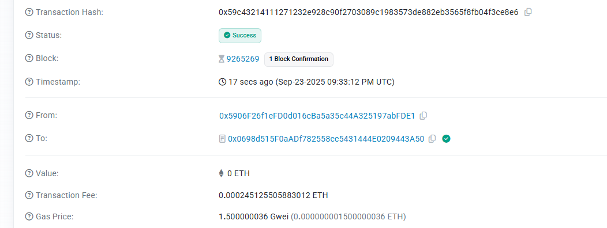

# Anonymous Comments Platform

A next-generation blockchain-based platform that enables truly anonymous discussions through Fully Homomorphic Encryption (FHE) technology. Experience complete privacy while participating in public discourse.

🌐 **Live Demo**: [https://anonymous-comments-six.vercel.app/](https://anonymous-comments-six.vercel.app/)

📁 **GitHub Repository**: [https://github.com/JimmieReilly/AnonymousComments](https://github.com/JimmieReilly/AnonymousComments)

## Core Concepts

### FHE Contract Anonymous Comment System

This platform revolutionizes online discussions by implementing **Fully Homomorphic Encryption (FHE)** directly within smart contracts. Unlike traditional comment systems where user data can be traced, our system ensures:

- **Mathematical Privacy**: Comments are encrypted using advanced FHE algorithms before being stored on the blockchain
- **Computational Privacy**: The smart contract can perform operations on encrypted data without ever decrypting it
- **Identity Protection**: User addresses and comment content remain cryptographically separated
- **Tamper-Proof Anonymity**: Once encrypted and stored, even the platform operators cannot link comments to users

### Privacy Comment Functionality

The privacy-first comment system offers unprecedented anonymity through:

#### Encrypted Content Storage
- All comment text is encrypted client-side using FHE before blockchain submission
- Encryption keys are managed through zero-knowledge protocols
- Comment metadata (timestamps, thread references) are also privacy-protected

#### Anonymous Interaction Layer
- Rating and voting systems that maintain complete user anonymity
- Thread creation without identity exposure
- Anonymous moderation capabilities through encrypted flagging

#### Decentralized Privacy Architecture
- No central authority can decrypt or trace user activities
- Smart contract logic operates entirely on encrypted data
- Client-side decryption for authorized content viewing only

## Smart Contract Information

**Contract Address**: `0x0698d515F0aADf782558cc5431444E0209443A50`

**Network**: Ethereum Sepolia Testnet

**Technology Stack**: Zama FHE (Fully Homomorphic Encryption)

## Demo Materials

### Video Demonstration


*The demo video showcases the complete user journey from wallet connection to anonymous comment submission and interaction.*

### On-Chain Transaction Screenshot


*Screenshot showing successful on-chain transactions for anonymous comment storage and retrieval.*

## Key Features

### 🔐 Complete Anonymity
- Military-grade FHE encryption for all user interactions
- Zero-knowledge proof integration for identity protection
- Anonymous voting and rating systems

### 🛡️ Blockchain Security
- Immutable comment storage on Ethereum blockchain
- Smart contract-enforced privacy rules
- Decentralized architecture eliminating single points of failure

### 🚀 Modern Web Experience
- Responsive design optimized for all devices
- Real-time blockchain interaction with instant feedback
- Progressive web app capabilities for mobile users

### 🔧 Technical Excellence
- Zero external dependencies beyond essential CDN libraries
- Optimized gas usage for cost-effective transactions
- Advanced error handling and user experience optimization

## Privacy Architecture

### Encryption Layer
The platform implements a multi-layered encryption approach:

1. **Client-Side Encryption**: All sensitive data is encrypted in the user's browser
2. **FHE Processing**: Smart contracts perform computations on encrypted data
3. **Key Management**: Decentralized key management through blockchain protocols
4. **Access Control**: Granular permission systems for content access

### Data Flow
```
User Input → Client-Side FHE Encryption → Smart Contract Storage →
Encrypted Retrieval → Client-Side Decryption → Display
```

### Security Guarantees
- **Forward Secrecy**: Past communications remain secure even if future keys are compromised
- **Post-Quantum Security**: FHE algorithms resistant to quantum computing attacks
- **Metadata Protection**: Even interaction patterns are obfuscated through privacy layers

## Technical Implementation

### Frontend Architecture
- **Pure Web Technologies**: HTML5, CSS3, and modern JavaScript ES6+
- **Web3 Integration**: Ethers.js for seamless blockchain interaction
- **Responsive Design**: CSS Grid and Flexbox for optimal cross-device experience

### Blockchain Integration
- **Smart Contract**: Solidity-based FHE contract with Zama integration
- **Gas Optimization**: Efficient contract design minimizing transaction costs
- **Event Handling**: Real-time blockchain event processing for instant updates

### Security Headers
- **Content Security Policy**: Strict CSP preventing XSS attacks
- **HTTPS Enforcement**: All connections secured with TLS encryption
- **CORS Configuration**: Precise cross-origin resource sharing rules

## Use Cases

### Anonymous Feedback Systems
- Corporate environments requiring honest employee feedback
- Academic peer review systems with identity protection
- Government transparency initiatives with whistleblower protection

### Community Discussions
- Sensitive topic discussions without fear of retaliation
- Mental health support communities with complete privacy
- Political discourse in restrictive environments

### Research and Academia
- Anonymous peer review systems for academic papers
- Survey and poll systems with guaranteed respondent privacy
- Collaborative research with confidential contribution tracking

## Future Roadmap

### Enhanced Privacy Features
- Implementation of ring signatures for additional anonymity layers
- Zero-knowledge proof integration for content verification
- Advanced mixing protocols for transaction privacy

### Platform Expansion
- Multi-chain deployment for broader ecosystem access
- Mobile-native applications for improved user experience
- Integration with existing social platforms through privacy bridges

### Community Governance
- Decentralized autonomous organization (DAO) for platform governance
- Community-driven moderation through encrypted voting systems
- Tokenomics for incentivizing quality anonymous contributions

## Community and Support

This project represents a significant advancement in blockchain-based privacy technology. We welcome contributions from developers, privacy advocates, and blockchain enthusiasts who share our vision of truly anonymous digital communication.

The platform demonstrates the practical implementation of theoretical cryptographic concepts, making advanced privacy technology accessible to everyday users while maintaining the highest security standards.

---

*Built with privacy-first principles and powered by cutting-edge FHE technology.*